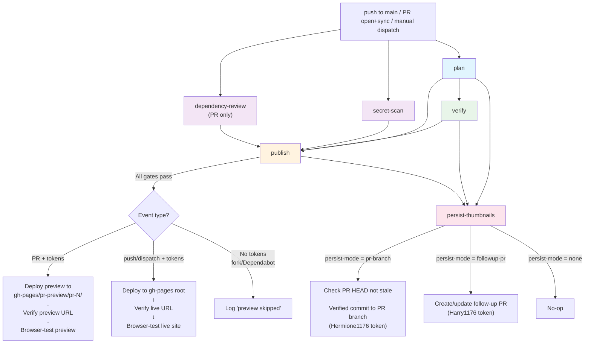
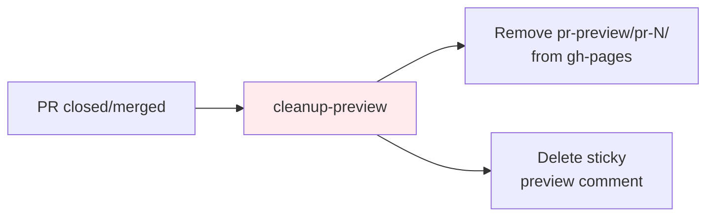
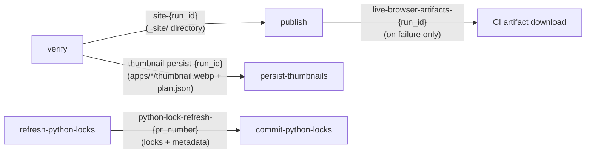

# Architecture

This document explains the system design: runtime shape, build flow, and CI/CD relationships.

- [`workspace.md`](workspace.md) is the canonical reference for file ownership, generated outputs, and source-of-truth locations.
- [`operations.md`](operations.md) owns day-to-day commands, troubleshooting, and recovery runbooks.
- [`maintenance.md`](maintenance.md) owns long-term stability contracts and review expectations.

The workflow files and helper scripts remain the executable source of truth. This document records the intended architecture and cross-component boundaries.

## Overview

This repository is a publishing platform for interactive HTML artifacts, hosted on GitHub Pages. Apps are self-contained HTML pages under `apps/`, like blog posts. The platform handles everything else: gallery rendering, thumbnail generation, metadata indexing, PR previews, deployment, and safety guardrails.

The system has three layers:

1. **Runtime**: how the gallery works in the browser
2. **Build**: how metadata, thumbnails, and the deployable site are generated
3. **CI/CD**: how code flows from commit to live site with safety checks at every step

## Runtime layer

The deployed site is static HTML with a generated data layer.

- `index.html` loads the gallery shell
- `css/style.css` imports the modular partials in `css/gallery/`
- `js/app.js` bootstraps runtime validation and initializes the gallery
- `js/modules/gallery/*` split the gallery into config validation, catalog helpers, render helpers, book-scene motion, URL state, and the main orchestrator
- `js/modules/runtime.js`, `js/modules/element-cache.js`, `js/modules/html-escape.js` provide shared utilities used by both the gallery and app modules
- `js/gallery-config.js` (generated) provides shared display metadata
- `js/data.js` (generated) provides artifact metadata
- `css/app-tokens.css`, `css/app-shell.css`, `js/app-theme.js`, `js/modules/app-shell.js` define the shared mature-app system
- `apps/*/index.html` pages are the artifact entry points, with app-local CSS, JS, and docs alongside them

### How the gallery loads

1. `index.html` loads stylesheets and scripts
2. `js/gallery-config.js` defines `window.ARTIFACTS_CONFIG`
3. `js/data.js` defines `window.ARTIFACTS_DATA`
4. `js/app.js` validates bootstrap data and calls `initializeGalleryApp`
5. `js/modules/gallery/gallery-app.js` restores URL-synced search, filters, sort, and manages theme, overlays, keyboard shortcuts, cards, and pagination
6. `js/modules/gallery/book-scene.js` runs the book cover intro and 3D page-turn animations
7. Clicking a card opens details and links to the artifact page under `apps/`

The gallery never inspects artifact HTML directly. It depends entirely on generated metadata.

## Build layer

### Metadata generation (`scripts/build/generate_index.py`)

- Uses an `IndexConfig` context object (`scripts/build/index_config.py`) that centralizes all generation configuration and convenience methods
- Loads the artifact contract via `scripts/lib/artifact_contract.py`, which provides shared contract types and path helpers used by both the index generator and app discovery
- Scans `apps/` for valid artifact folders
- Reads `name.txt`, `description.txt`, `tags.txt`, `tools.txt`
- Resolves thumbnails from `thumbnail.webp`
- Writes `js/gallery-config.js` and `js/data.js`
- Updates README auto markers (site URL, counts, badges)

### Thumbnail generation (`scripts/build/generate_thumbnails.py`)

- Serves the repo over local HTTP so app pages load shared CSS/JS
- Opens each artifact page in Playwright
- Waits for `window.__ARTIFACT_READY__ !== false` before capture
- Captures, resizes, and writes a WebP thumbnail

### Deployable site assembly (`scripts/build/prepare_site.py`)

- Copies site files into `_site/`
- Applies cache-busting query strings to root assets
- Injects canonical, Open Graph, and Twitter share metadata
- Injects the configured site path into `404.html` and the web app manifest
- Writes `deploy-metadata.json` with the deploy commit SHA and version
- Writes `.nojekyll` for branch-based Pages deployment

## CI/CD layer

### Main pipeline (`update.yml`)

This is the core workflow. It triggers on every push to `main`, every PR event (opened, reopened, synchronize, closed), and manual dispatch.

### Pipeline walkthrough by scenario

This section summarizes the intended flow for each trigger scenario. Use it to understand the job boundaries and data flow. For exact step definitions, job permissions, and current conditionals, read the workflow YAML and helper scripts.

#### Scenario 1: Push a commit to a same-repo PR branch

Trigger: `pull_request` event with `action: opened | reopened | synchronize`. The PR targets `main` and the head repo is the same repo (not a fork). The author is not `dependabot[bot]`.

**Parallel start (three jobs launch simultaneously):**

- **`plan`** (timeout: 5 min, permissions: contents read, pull-requests read)
  - Calls `scripts/ci/workflow_helpers.py thumbnail-plan` with the event context.
  - Queries the GitHub API for changed files in the PR.
  - Classifies each changed file: runtime change (`index.html`, `css/`, `js/`, `assets/`), metadata change (`name.txt`, `tags.txt`, etc.), docs change, or shared infra change (`css/app-tokens.css`, `css/app-shell.css`, `js/app-theme.js`, `js/modules/app-shell.js`).
  - Outputs: `browser-scope` (all / changed / none), `thumbnail-scope` (all / changed / none), `persist-mode` (pr-branch), `changed-slugs`, `thumbnail-slugs`, `reason`.
  - Reads: PR branch code (checkout). Writes: nothing.

- **`secret-scan`** (timeout: 5 min, permissions: contents read)
  - Runs Gitleaks against the full commit history (`fetch-depth: 0`).
  - Reads: git history. Writes: nothing.

- **`dependency-review`** (timeout: 5 min, permissions: contents read, PR events only)
  - Checks manifest and lockfile changes for known vulnerabilities.
  - Reads: PR diff. Writes: nothing.

**After `plan` completes → `verify` starts:**

- **`verify`** (timeout: 20 min, permissions: contents read, pull-requests read)
  - Does NOT wait for `secret-scan` or `dependency-review`. Those continue in the background.
  - Step by step:
    1. Checks out the PR branch code.
    2. Installs Python, Node, and Chromium (`make setup-ci`).
    3. Runs `make check-local`: EditorConfig check, ruff, ESLint, stylelint, yamllint, workflow lint, JS source-to-test coverage lint, Python tests (100% coverage on `scripts/`), JS tests, JS coverage (95/85/95 thresholds), pip-audit, npm audit, artifact directory validation, and canonical generated-file drift verification.
    4. If `thumbnail-scope` is not `none`: calls `scripts/ci/workflow_helpers.py invalidate-thumbnails` to delete stale `thumbnail.webp` files for apps with runtime changes, so they will be regenerated fresh.
    5. Runs `make test-browser-root`: opens the gallery in Chromium, tests search, filters, pagination, detail overlay, keyboard navigation, accessibility, `404.html`.
    6. If `browser-scope` is not `none`: runs `make test-browser-apps`. If `browser-scope` is `changed`, scopes to only the changed app slugs via `ARTIFACTS_BROWSER_APP_SLUGS`. If `all`, tests every mature app.
    7. Runs `make thumbnails`: opens each affected app in Chromium, waits for `window.__ARTIFACT_READY__`, captures and saves `thumbnail.webp`.
    8. Runs `make index`: scans `apps/`, generates `js/data.js` and `js/gallery-config.js`, updates README.
    9. Runs `make site`: copies into `_site/`, cache-busts assets, injects social metadata, writes `deploy-metadata.json`.
    10. Uploads `_site/` as artifact `site-{run_id}`.
    11. If `persist-mode` is not `none` and thumbnails actually changed: packages `apps/*/thumbnail.webp` files plus `plan.json` into artifact `thumbnail-persist-{run_id}`.
  - Reads: PR branch code. Writes: nothing (only uploads artifacts to GitHub Actions storage).

**After ALL FOUR complete (plan + verify + secret-scan + dependency-review) → `publish` starts:**

- **`publish`** (timeout: 25 min, permissions: contents write, issues write, pull-requests write)
  - Will not start if `verify` or `secret-scan` failed. `dependency-review` must succeed or be skipped.
  - Step by step:
    1. Checks out the PR branch code (for `pyproject.toml` reading only, `persist-credentials: false`).
    2. Runs `ci-setup` action: calls `scripts/ci/workflow_helpers.py app-token-policy` → tokens allowed (same-repo, not fork, not Dependabot). Mints Hermione1176 (primary) and Harry1176 (escalation) tokens.
    3. Downloads the `site-{run_id}` artifact into `_site/`. Does NOT rebuild anything.
    4. Installs Chromium for live browser tests (`make setup-ci`).
    5. Reads site URL from `pyproject.toml`, constructs preview URL: `{site_url}/pr-preview/pr-{N}/`.
    6. Deploys `_site/` to `gh-pages` branch under `pr-preview/pr-{N}/` using `deploy-verified.mjs` with `DEPLOY_SUBDIR`. This is a verified GraphQL commit using the Harry1176 (escalation) token. Only touches that subdirectory. The main site and other PR previews are untouched.
    7. Posts a sticky comment on the PR with the preview URL (recreated on each push so the latest is always at the bottom).
    8. Calls `scripts/ci/verify_deploy.py` to poll the preview URL until it serves the expected cache-busted HTML and `deploy-metadata.json` SHA.
    9. Runs `make test-browser-live` against the preview URL in Chromium.
  - Reads: `site-{run_id}` artifact. Writes: `gh-pages` branch (preview subdirectory only), PR comment.

**After `publish` succeeds AND `persist-mode` is not `none` AND thumbnails changed → `persist-thumbnails` starts:**

- **`persist-thumbnails`** (timeout: 15 min, permissions: contents write, pull-requests write)
  - Step by step:
    1. Checks out the PR branch code.
    2. Runs `ci-setup` to mint tokens.
    3. Downloads the `thumbnail-persist-{run_id}` artifact.
    4. Calls `scripts/ci/workflow_helpers.py validate-thumbnail-artifact` to verify the artifact matches the plan (no symlinks, only expected files).
    5. Re-checks the PR HEAD SHA via `gh pr view`. If the PR branch has been pushed to since the workflow started (stale), skips the commit to avoid conflicts.
    6. If not stale: copies `thumbnail.webp` files from the artifact into the workspace, stages them with `git add`, and creates a verified commit directly on the PR branch using the Hermione1176 (primary) token with `commit-mode: direct`.
  - Reads: `thumbnail-persist-{run_id}` artifact. Writes: the PR branch (adds `apps/*/thumbnail.webp` files).

#### Scenario 2: Push a commit to `main`

Trigger: `push` event on `main` branch, or `workflow_dispatch`.

The flow is identical to Scenario 1 with these differences:

- **`plan`**: `persist-mode` is `followup-pr` when runtime changes or missing thumbnails require thumbnail persistence, otherwise `none`. It is never `pr-branch` because there is no PR.
- **`dependency-review`**: does not run (not a PR event). `publish` treats it as `skipped`, which is acceptable.
- **`publish`**: instead of deploying a preview, deploys `_site/` to the **root** of `gh-pages`, replacing the live site. Preserves the `pr-preview/` directory so existing PR previews keep working. Uses the `deploy-site` composite action with `skip-build: true`. Verifies and browser-tests the live production URL.
- **`persist-thumbnails`**: if `persist-mode` is `followup-pr`, creates or updates a follow-up PR on a dated branch (`ci/save-generated-thumbnails-YYYYMMDD`) targeting `main`. Uses the Harry1176 (escalation) token with `commit-mode: force-pr`. The PR body contains a marker (`<!-- artifacts:generated-thumbnails -->`) for loop detection. When this follow-up PR is later merged to `main`, the planner recognizes it via PR provenance and sets `persist-mode: none` to prevent infinite loops. Stale-check is not performed because there is no PR branch to check.

#### Scenario 3: Close or merge a PR

Trigger: `pull_request` event with `action: closed`.

Only `cleanup-preview` runs. No other jobs run.

- **`cleanup-preview`** (timeout: 5 min, permissions: contents write, issues write, pull-requests write)
  - Runs `ci-setup` to mint tokens (note: uses hardcoded `event-name: pull_request`, not `github.event_name`).
  - If tokens available: removes `pr-preview/pr-{N}/` from `gh-pages` using `deploy-verified.mjs` with `REMOVE_SUBDIR`. Deletes the sticky preview comment.
  - If tokens unavailable (fork/Dependabot): does nothing. There was no preview to clean up.
  - Reads: nothing. Writes: `gh-pages` branch (removes preview subdirectory), deletes PR comment.

#### Scenario 4: Fork PR or Dependabot PR

Trigger: `pull_request` event where `head.repo.fork == true` or `user.login == 'dependabot[bot]'`.

The flow is identical to Scenario 1 with these differences:

- **`plan`**: `persist-mode` is `none`. Tokens will not be minted.
- **`verify`**: runs fully. The code is still built, tested, and validated. The `_site/` artifact is still produced.
- **`publish`**: `ci-setup` calls `app-token-policy` which returns `allowed=false`. Token minting is skipped. Publish logs "Preview deployment is skipped because the app token is unavailable (fork or Dependabot PR)" to the step summary. No deployment happens. No browser-live tests run.
- **`persist-thumbnails`**: does not run (`persist-mode` is `none`).

The code is fully validated but never deployed and never written back to the source branch.

#### Branch write summary

| Branch                             | Written by                                    | When                                                                               | What is written                                                                 |
| ---------------------------------- | --------------------------------------------- | ---------------------------------------------------------------------------------- | ------------------------------------------------------------------------------- |
| PR branch (e.g. `feature/new-app`) | `persist-thumbnails`                          | Same-repo PR with runtime changes and thumbnail changes                            | `apps/*/thumbnail.webp` files via verified commit (Hermione1176)                |
| Dependabot PR branch               | `commit-python-locks`                         | Same-repo Dependabot pip PRs when direct verified commit succeeds                  | `locks/requirements.lock` and `locks/requirements-dev.lock` via verified commit |
| `ci/refresh-python-locks-*`        | `commit-python-locks`                         | Same-repo Dependabot pip PRs when lock refresh writeback falls back to a PR branch | Fallback PR branch containing refreshed Python lock files                       |
| `main`                             | Maintenance workflows using `verified-commit` | When a trusted maintenance workflow can commit directly to the default branch      | Verified maintenance commits such as GitHub Action SHA refreshes                |
| `ci/refresh-action-shas-*`         | `refresh-action-shas`                         | When maintenance updates cannot be committed directly to the default branch        | Fallback PR branch containing workflow SHA refreshes                            |
| `gh-pages`                         | `publish`                                     | Every successful deploy (PR preview or main site)                                  | Verified commit replacing site root or preview subdirectory (Harry1176)         |
| `gh-pages`                         | `cleanup-preview`                             | PR closed/merged                                                                   | Verified commit removing preview subdirectory (Harry1176)                       |
| `ci/save-generated-thumbnails-*`   | `persist-thumbnails`                          | Push to `main` with runtime-driven thumbnail changes or missing thumbnails         | Follow-up PR branch with `thumbnail.webp` files (Harry1176)                     |

### Auxiliary workflows

```mermaid
graph TD
    subgraph "Python lock refresh (Dependabot pip PRs)"
        dep_pr["Dependabot PR changes pyproject.toml"] --> refresh["refresh-python-locks<br/>Compute new lock files<br/>Upload as artifact"]
        refresh --> commit["commit-python-locks<br/>Download artifact<br/>Validate contents<br/>Check PR HEAD not stale<br/>Verified commit to PR branch"]
    end

    subgraph "Action SHA refresh (monthly)"
        schedule["1st of month / manual"] --> sha_refresh["refresh-action-shas<br/>Resolve latest SHAs for<br/>pinned actions in workflows<br/>Verified commit or PR"]
    end

    subgraph "Repo settings audit (weekly)"
        audit_schedule["Monday 8:23 UTC / manual"] --> audit["audit-repo-settings<br/>Check Pages, branch protection,<br/>variables, secrets, gh-pages ruleset<br/>Report drift"]
    end

    subgraph "Live smoke (daily)"
        smoke_schedule["Daily 06:17 UTC / manual"] --> live_smoke["live-site-smoke<br/>Run make test-browser-live<br/>against published site<br/>Open or close alert issue"]
    end
```

**Python lock refresh** keeps Dependabot pip PRs self-contained: when a Dependabot PR changes `pyproject.toml`, `refresh-python-locks.yml` runs `make lock` on the PR branch and uploads the refreshed lock files as an artifact. Then `commit-python-locks.yml` (triggered by `workflow_run`) downloads the artifact, validates it (checks for symlinks, required files, and PR metadata), verifies the PR branch hasn't moved, and uses the shared verified-commit flow to write the refreshed locks back to the PR branch or fall back to a maintenance PR branch when a direct write is not possible.

**Action SHA refresh** runs monthly to keep pinned action references current. It scans all workflow files for `uses:` lines, resolves each ref to a commit SHA via the GitHub API, and updates the files.

**Repo settings audit** runs weekly and on manual dispatch. It calls `scripts/ci/workflow_helpers.py audit-repo-settings` to check that Pages, branch protection, repository variables/secrets, and the gh-pages ruleset match the expected contract. Drift is reported to the step summary, opens or updates a dedicated GitHub issue, and closes that issue automatically once the audit passes again.

**Live site smoke** runs daily and on manual dispatch. It executes `make test-browser-live` against the published site URL, uploads Playwright failure artifacts on regression, opens or updates a dedicated GitHub issue when the live smoke test fails, and closes that issue automatically once the live site passes again.

### Workflow reference

| File                       | Triggers                                                 | Jobs                                                                                       |
| -------------------------- | -------------------------------------------------------- | ------------------------------------------------------------------------------------------ |
| `update.yml`               | push to main, PR (open/sync/close), manual               | plan, verify, secret-scan, dependency-review, publish, persist-thumbnails, cleanup-preview |
| `audit-repo-settings.yml`  | weekly Mon 8:23 UTC, manual                              | audit                                                                                      |
| `live-site-smoke.yml`      | daily 06:17 UTC, manual                                  | smoke                                                                                      |
| `refresh-python-locks.yml` | Same-repo Dependabot pip PR with `pyproject.toml` change | refresh-locks                                                                              |
| `commit-python-locks.yml`  | after refresh-python-locks completes                     | commit-locks                                                                               |
| `refresh-action-shas.yml`  | monthly 1st 3:00 UTC, manual                             | refresh                                                                                    |

### Custom actions

| Action            | Purpose                                                      | Key behavior                                                                                                                               |
| ----------------- | ------------------------------------------------------------ | ------------------------------------------------------------------------------------------------------------------------------------------ |
| `ci-setup`        | Mint app tokens, set up Python/Node, optionally install deps | Calls `scripts/ci/workflow_helpers.py app-token-policy` to decide if tokens are allowed; blocks tokens for forks and Dependabot            |
| `deploy-site`     | Build `_site/`, deploy to gh-pages, verify published URL     | Uses `deploy-verified.mjs` for GraphQL verified commits; calls `scripts/ci/verify_deploy.py` to poll for expected HTML and metadata        |
| `verified-commit` | Create a verified commit or fall back to a PR                | Uses `verified-commit.mjs`; supports direct, force-pr, and direct-or-pr modes; handles branch conflict by creating a dated fallback branch |

### Script dependency map

| Script                                                       | Called by                                | Purpose                                                                                                      |
| ------------------------------------------------------------ | ---------------------------------------- | ------------------------------------------------------------------------------------------------------------ |
| `scripts/ci/workflow_helpers.py thumbnail-plan`              | plan job                                 | Compute the full automation plan (browser/thumbnail/persist scope)                                           |
| `scripts/ci/workflow_helpers.py invalidate-thumbnails`       | verify job                               | Delete stale thumbnails for apps with runtime changes                                                        |
| `scripts/ci/workflow_helpers.py app-token-policy`            | ci-setup action                          | Decide if app tokens should be minted                                                                        |
| `scripts/ci/workflow_helpers.py validate-thumbnail-artifact` | persist-thumbnails job                   | Validate thumbnail artifact matches the plan                                                                 |
| `scripts/ci/workflow_helpers.py audit-repo-settings`         | audit-repo-settings workflow             | Check Pages, protection, variables, secrets, ruleset                                                         |
| `scripts/ci/workflow_helpers.py read-lock-metadata`          | commit-python-locks workflow             | Read PR metadata from lock refresh artifact                                                                  |
| `scripts/ci/workflow_helpers.py validate-lock-artifact`      | commit-python-locks workflow             | Validate lock refresh artifact integrity                                                                     |
| `scripts/ci/verify_deploy.py`                                | deploy-site action, publish job          | Poll published URL for expected HTML marker and deploy metadata SHA                                          |
| `deploy-verified.mjs`                                        | deploy-site action, publish/cleanup jobs | Deploy to gh-pages via GraphQL verified commit; handles full site, preview subdirectory, and preview removal |
| `verified-commit.mjs`                                        | verified-commit action                   | Create verified commit via GraphQL; fall back to PR on conflict                                              |

### Artifact flow

### Token model

Two GitHub Apps provide elevated permissions beyond the default `GITHUB_TOKEN`:

| App                    | ID variable / Secret                                            | Used for                                                                |
| ---------------------- | --------------------------------------------------------------- | ----------------------------------------------------------------------- |
| Hermione1176 (primary) | `vars.APP_ID` / `secrets.APP_PRIVATE_KEY`                       | Same-PR thumbnail writeback                                             |
| Harry1176 (escalation) | `vars.ESCALATION_APP_ID` / `secrets.ESCALATION_APP_PRIVATE_KEY` | All deploys (main, preview, cleanup), follow-up thumbnail PRs from main |

| Context         | Tokens available? | Deploy?        | Thumbnail persist?  |
| --------------- | ----------------- | -------------- | ------------------- |
| Same-repo PR    | Yes               | Preview deploy | PR branch writeback |
| Push to main    | Yes               | Main deploy    | Follow-up PR        |
| Fork PR         | No                | Skip           | Skip                |
| Dependabot PR   | No                | Skip           | Skip                |
| Manual dispatch | Yes               | Main deploy    | Follow-up PR        |

### Thumbnail persistence modes

The `plan` job computes a `persist-mode` from the event context:

| Mode          | When                                                  | What happens                            |
| ------------- | ----------------------------------------------------- | --------------------------------------- |
| `none`        | Fork PR, Dependabot PR, docs-only, no runtime changes | No source mutation                      |
| `pr-branch`   | Trusted same-repo PR with runtime changes             | Thumbnails committed to the PR branch   |
| `followup-pr` | Push to main with missing thumbnails                  | New PR opened (or existing one updated) |

Loop prevention: merging a follow-up thumbnail PR is detected via PR provenance (not commit message), so squash-merge settings don't break the detection.

### External GitHub settings

The workflows depend on repository settings that are not enforceable from source control alone:

- GitHub Pages publishes from `gh-pages` branch root with HTTPS enforced
- `vars.APP_ID` and `vars.ESCALATION_APP_ID` contain the GitHub App IDs
- `secrets.APP_PRIVATE_KEY` and `secrets.ESCALATION_APP_PRIVATE_KEY` contain the private keys
- `secrets.GITLEAKS_LICENSE` for the Gitleaks action
- `main` branch protection requires `verify`, `secret-scan`, and `dependency-review` checks plus review/signing/history requirements
- `gh-pages` branch ruleset blocks create/delete/update/force-push except for the deploy app and repo admin
- `.github/workflows/audit-repo-settings.yml` is the automated drift check for all of the above

## Configuration strategy

`workspace.md` owns the repository ownership map. This section only explains why these configuration files matter to the system design.

| Config file                     | Owns                                                               |
| ------------------------------- | ------------------------------------------------------------------ |
| `pyproject.toml`                | Python deps, pytest/coverage/ruff settings, site URL and metadata  |
| `package.json`                  | Node deps, JS test/coverage config, npm script commands            |
| `config/artifact_contract.json` | Shared artifact id, URL, and thumbnail path validation contract    |
| `eslint.config.js`              | ESLint file patterns, ignores, rules                               |
| `stylelint.config.js`           | Stylelint rules, ignoreFiles                                       |
| `.yamllint.yml`                 | Yamllint rules, ignore patterns                                    |
| `.editorconfig`                 | Editor formatting rules per file type                              |
| `config/gallery_metadata.json`  | Tag/tool display metadata for gallery config and README badges     |
| `config/security_audit.json`    | Python lock-file audit scope and reviewed vulnerability exceptions |

Each tool primarily reads its own config, and the Makefile mostly serves as the entry point that calls those tools. Prefer changing tool scope in the owning config file rather than scattering overlapping scope rules across workflow steps and scripts. See [ADR 0003](adr/0003-makefile-first-and-single-source-of-truth.md).

## Design decisions

- [ADR 0001](adr/0001-root-publishing-platform.md): Treat the repo root as a strict publishing platform. Verify once, deploy verified artifacts, fail closed.
- [ADR 0002](adr/0002-shared-app-system-and-thumbnail-persistence.md): Shared app system with planner-driven thumbnail persistence
- [ADR 0003](adr/0003-makefile-first-and-single-source-of-truth.md): Makefile-first workflow and tool-config source-of-truth policy
