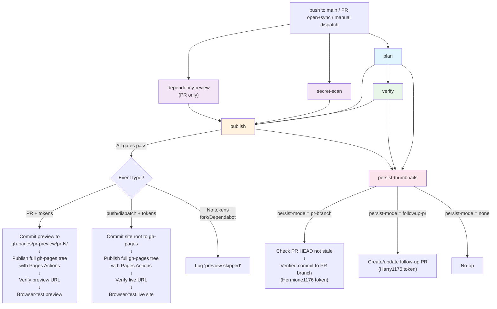
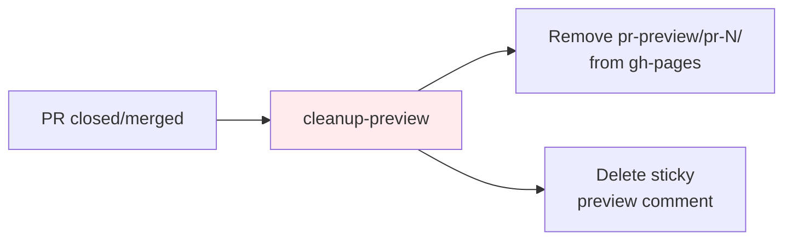
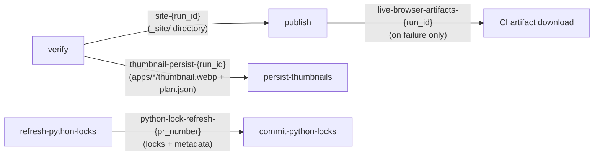

# Architecture

This document explains the system design: runtime shape, build flow, and CI/CD relationships.

- [`workspace.md`](workspace.md) is the canonical reference for file ownership, generated outputs, and source-of-truth locations.
- [`operations.md`](operations.md) owns day-to-day commands, troubleshooting, and recovery runbooks.
- [`maintenance.md`](maintenance.md) owns long-term stability contracts and review expectations.

The workflow files and helper scripts remain the executable source of truth. This document records the intended architecture and cross-component boundaries.

## Overview

This repository is a publishing platform for interactive HTML artifacts, hosted on GitHub Pages. Apps are self-contained HTML pages under `apps/`, like blog posts. The platform handles everything else: gallery rendering, thumbnail generation, metadata indexing, PR previews, deployment, and safety guardrails.

The system has three layers:

1. **Runtime**: how the gallery works in the browser
2. **Build**: how metadata, thumbnails, and the deployable site are generated
3. **CI/CD**: how code flows from commit to live site with safety checks at every step

## Runtime layer

The deployed site is static HTML with a generated data layer.

- `index.html` loads the gallery shell
- `css/style.css` provides root-gallery styling, shared app tokens, and shared app shell rules. Mature apps load app-specific layout rules from `apps/<slug>/css/app.css`.
- `js/app.js` bootstraps runtime validation and initializes the gallery
- `js/modules/gallery/*` split the gallery into config validation, catalog helpers, render helpers, book-scene motion, URL state, and the main orchestrator
- `js/modules/runtime.js`, `js/modules/element-cache.js`, `js/modules/html-escape.js` provide shared utilities used by both the gallery and app modules
- `js/gallery-config.js` (generated) provides shared display metadata
- `js/data.js` (generated) provides artifact metadata
- `js/app-theme.js` and `js/modules/app-shell.js` define the shared mature-app runtime system
- `apps/*/index.html` pages are the artifact entry points, with app-local JS and docs alongside them

### How the gallery loads

1. `index.html` loads the stylesheet and scripts
2. `js/gallery-config.js` defines `window.ARTIFACTS_CONFIG`
3. `js/data.js` defines `window.ARTIFACTS_DATA`
4. `js/app.js` validates bootstrap data and calls `initializeGalleryApp`
5. `js/modules/gallery/gallery-app.js` restores URL-synced search, filters, sort, and manages theme, overlays, keyboard shortcuts, cards, and pagination
6. `js/modules/gallery/book-scene.js` runs the book cover intro and 3D page-turn animations
7. Clicking a card lazily loads `detail-overlay.js` via dynamic `import()` and opens the detail panel; subsequent clicks use the cached module

The gallery never inspects artifact HTML directly. It depends entirely on generated metadata.

## Build layer

### Metadata generation (`scripts/build/generate_index.py`)

- Uses an `IndexConfig` context object (`scripts/build/index_config.py`) that centralizes all generation configuration and convenience methods
- Loads the artifact contract via `scripts/lib/artifact_contract.py`, which provides shared contract types and path helpers used by both the index generator and app discovery
- Scans `apps/` for valid artifact folders
- Reads `name.txt`, `description.txt`, `tags.txt`, `tools.txt`
- Resolves thumbnails from `thumbnail.webp`
- Writes `js/gallery-config.js` and `js/data.js`
- Updates README auto markers (site URL, counts, badges)

### Thumbnail generation (`scripts/build/generate_thumbnails.py`)

- Serves the repo over local HTTP so app pages load shared CSS/JS
- Opens each artifact page in Playwright
- Waits for `window.__ARTIFACT_READY__ !== false` before capture
- Captures, resizes, and writes a WebP thumbnail

### Deployable site assembly (`scripts/build/prepare_site.py`)

- Copies site files into `_site/`
- Inlines CSS `@import` chains into single files
- Applies cache-busting query strings to root assets
- Injects canonical, Open Graph, and Twitter share metadata
- Injects the configured site path into `404.html` and the web app manifest
- Injects `<link rel="modulepreload">` hints by walking the static ES module import tree for each HTML entry point
- Minifies CSS and JS assets using esbuild (skips vendor and already-minified files)
- Writes `deploy-metadata.json` with the deploy commit SHA and version
- Writes `.nojekyll` for branch-based Pages deployment

## CI/CD layer

### Main pipeline (`update.yml`)

This is the core workflow. It triggers on every push to `main`, every PR event (opened, reopened, synchronize, closed), and manual dispatch.

### Pipeline walkthrough by scenario

This section summarizes the intended flow for each trigger scenario. Use it to understand the job boundaries and data flow. For exact step definitions, job permissions, and current conditionals, read the workflow YAML and helper scripts.

#### Scenario 1: Push a commit to a same-repo PR branch

Trigger: `pull_request` event with `action: opened | reopened | synchronize`. The PR targets `main` and the head repo is the same repo (not a fork). The author is not `dependabot[bot]`.

**Parallel start (three jobs launch simultaneously):**

- **`plan`** (timeout: 5 min, permissions: contents read, pull-requests read)
  - Calls `scripts/ci/workflow_helpers.py thumbnail-plan` with the event context.
  - Queries the GitHub API for changed files in the PR.
  - Classifies each changed file: runtime change (`index.html`, `js/`, `assets/`, `css/`), metadata change (`name.txt`, `tags.txt`, etc.), docs change, or shared infra change (`css/style.css`, `js/app-theme.js`, `js/modules/app-shell.js`).
  - Resolves the primary app bot login dynamically from `vars.APP_ID` / `secrets.APP_PRIVATE_KEY` via `actions/create-github-app-token` (with `continue-on-error: true` for forks and Dependabot PRs where secrets are unavailable).
  - Computes `skip-verification`: `true` only when the workflow actor matches the resolved app bot login AND every file in the triggering commit is a thumbnail. For main pushes from merged thumbnail follow-up PRs, the commit-level files check is applied as defense-in-depth alongside existing PR provenance detection. Any detection failure defaults to `false` (full pipeline runs).
  - Outputs: `browser-scope` (all / changed / none), `thumbnail-scope` (all / changed / none), `persist-mode` (pr-branch), `changed-slugs`, `thumbnail-slugs`, `reason`, `skip-verification`.
  - Reads: PR branch code (checkout). Writes: nothing.

- **`secret-scan`** (timeout: 5 min, permissions: contents read)
  - Runs Gitleaks against the full commit history (`fetch-depth: 0`).
  - Reads: git history. Writes: nothing.

- **`dependency-review`** (timeout: 5 min, permissions: contents read, PR events only)
  - Checks manifest and lockfile changes for known vulnerabilities.
  - Reads: PR diff. Writes: nothing.

**After `plan` completes → `verify` starts:**

- **`verify`** (timeout: 20 min, permissions: contents read, pull-requests read)
  - Skipped when the planner sets `skip-verification: true` (automated thumbnail-only commit by the trusted app bot). This eliminates redundant CI when `persist-thumbnails` commits thumbnails back to the PR branch.
  - Does NOT wait for `secret-scan` or `dependency-review`. Those continue in the background.
  - Step by step:
    1. Checks out the PR branch code.
    2. Sets up Python and Node, restores cached uv downloads and Playwright browsers, then runs `make setup-ci` to install project dependencies and ensure Chromium is available.
    3. Runs `scripts/ci/run_parallel_checks.py` to execute independent checks concurrently: `format-check`, `lint`, `typecheck`, `test-py`, `coverage-js`, `dead-code`, `security`, `validate`, and `test-browser-root`. Each check captures output; failures print unfolded logs while passes are folded with `::group::`.
    4. If `browser-scope` is not `none`: runs `make test-browser-apps`. If `browser-scope` is `changed`, scopes to only the changed app slugs via `ARTIFACTS_BROWSER_APP_SLUGS`. If `all`, tests every mature app.
    5. If `thumbnail-scope` is not `none`: calls `scripts/ci/workflow_helpers.py invalidate-thumbnails` to delete stale `thumbnail.webp` files for apps with runtime changes, so they will be regenerated fresh.
    6. Runs the sequential build chain: `make thumbnails` → `make check-generated` → `make index` → `make site`.
    7. Uploads `_site/` as artifact `site-{run_id}`.
    8. If `persist-mode` is not `none` and thumbnails actually changed: packages `apps/*/thumbnail.webp` files plus `plan.json` into artifact `thumbnail-persist-{run_id}`.
  - Reads: PR branch code. Writes: nothing (only uploads artifacts to GitHub Actions storage).

**After ALL FOUR complete (plan + verify + secret-scan + dependency-review) → `publish` starts:**

- **`publish`** (timeout: 25 min, permissions: actions read, contents write, issues write, pages write, pull-requests write, id-token write)
  - Skipped alongside `verify` when `skip-verification: true`.
  - Will not start if `verify` or `secret-scan` failed. `dependency-review` must succeed or be skipped.
  - Step by step:
    1. Checks out the PR branch code (for `pyproject.toml` reading only, `persist-credentials: false`).
    2. Runs `ci-setup` action: calls `scripts/ci/workflow_helpers.py app-token-policy` → tokens allowed (same-repo, not fork, not Dependabot). Mints Hermione1176 (primary) and Harry1176 (escalation) tokens.
    3. Downloads the `site-{run_id}` artifact into `_site/`. Does NOT rebuild anything.
    4. Restores cached Playwright browsers, then runs `make setup-ci` to install project dependencies and ensure Chromium is available for live browser tests.
    5. Reads site URL from `pyproject.toml`, constructs preview URL: `{site_url}/pr-preview/pr-{N}/`.
    6. Commits `_site/` to `gh-pages` under `pr-preview/pr-{N}/` using `deploy-verified.mjs` with `DEPLOY_SUBDIR`. This is a verified GraphQL commit using the Harry1176 (escalation) token. Only touches that subdirectory. The main site and other PR previews are untouched.
    7. Fetches the exact `gh-pages` commit it just produced, materializes the full branch tree into `.artifacts/pages-publish`, rejects symlinks, keeps `.nojekyll`, uploads that full tree with `actions/upload-pages-artifact`, and deploys it with `actions/deploy-pages`.
    8. Posts a sticky comment on the PR with the preview URL (recreated on each push so the latest is always at the bottom).
    9. Calls `scripts/ci/verify_deploy.py` to poll the preview URL until it serves the expected cache-busted HTML and `deploy-metadata.json` SHA.
    10. Runs `make test-browser-live` against the preview URL in Chromium.
  - Reads: `site-{run_id}` artifact. Writes: `gh-pages` branch (preview subdirectory only), GitHub Pages deployment, PR comment.

**After `publish` succeeds AND `persist-mode` is not `none` AND thumbnails changed → `persist-thumbnails` starts:**

- **`persist-thumbnails`** (timeout: 15 min, permissions: contents write, pull-requests write)
  - Step by step:
    1. Checks out the PR branch code.
    2. Runs `ci-setup` to mint tokens.
    3. Downloads the `thumbnail-persist-{run_id}` artifact.
    4. Calls `scripts/ci/workflow_helpers.py validate-thumbnail-artifact` to verify the artifact matches the plan (no symlinks, only expected files).
    5. Re-checks the PR HEAD SHA via `gh pr view`. If the PR branch has been pushed to since the workflow started (stale), skips the commit to avoid conflicts.
    6. If not stale: copies `thumbnail.webp` files from the artifact into the workspace, stages them with `git add`, and creates a verified commit directly on the PR branch using the Hermione1176 (primary) token with `commit-mode: direct`.
  - Reads: `thumbnail-persist-{run_id}` artifact. Writes: the PR branch (adds `apps/*/thumbnail.webp` files).
  - This commit triggers a second workflow run (app token commits fire `synchronize` events). The planner detects it as an automated thumbnail-only commit (`skip-verification: true`), so the follow-up run skips the full verification/publish path and completes with `plan` + `secret-scan` + `dependency-review` (~2-5 min instead of ~45 min).

#### Scenario 2: Push a commit to `main`

Trigger: `push` event on `main` branch, or `workflow_dispatch`.

The flow is identical to Scenario 1 with these differences:

- **`plan`**: `persist-mode` is `followup-pr` when runtime changes or missing thumbnails require thumbnail persistence, otherwise `none`. It is never `pr-branch` because there is no PR.
- **`dependency-review`**: does not run (not a PR event). `publish` treats it as `skipped`, which is acceptable.
- **`publish`**: instead of deploying a preview, commits `_site/` to the **root** of `gh-pages`, replacing the live site state. Preserves the `pr-preview/` directory so existing PR previews keep working. Uses the `deploy-site` composite action with `skip-build: true`, then uploads and deploys the full `gh-pages` tree with the official Pages Actions. Verifies and browser-tests the live production URL. It also writes a classic deployment record: after the Pages deploy it creates a `github-pages` deployment via `POST /repos/{owner}/{repo}/deployments` (with `required_contexts: []` sent through `gh api --input -` so it does not wait on status checks), then marks that deployment `success` once verification and live browser tests pass, or `failure` if the job fails after the record was created. This runs for main-site publishes only (guarded by the same main-only condition as the main deploy) so the Deployments page and environment badge stay honest. The record is created with the workflow `GITHUB_TOKEN`, which carries `deployments: write` on the publish job.
- **`persist-thumbnails`**: if `persist-mode` is `followup-pr`, creates or updates a follow-up PR on a dated branch (`ci/save-generated-thumbnails-YYYYMMDD`) targeting `main`. Uses the Harry1176 (escalation) token with `commit-mode: force-pr`. The PR body contains a marker (`<!-- artifacts:generated-thumbnails -->`) for loop detection. When this follow-up PR is later merged to `main`, the planner recognizes it via PR provenance and sets `persist-mode: none` to prevent infinite loops. The commit-level files check also sets `skip-verification: true` when the merge commit contains only thumbnail files, eliminating the redundant deploy. Stale-check is not performed because there is no PR branch to check.

#### Scenario 3: Close or merge a PR

Trigger: `pull_request` event with `action: closed`.

Only `cleanup-preview` runs. No other jobs run.

- **`cleanup-preview`** (timeout: 8 min, permissions: actions read, contents write, issues write, pages write, pull-requests write, id-token write)
  - Runs `ci-setup` to mint tokens (note: uses hardcoded `event-name: pull_request`, not `github.event_name`).
  - If tokens available: removes `pr-preview/pr-{N}/` from `gh-pages` using `deploy-verified.mjs` with `REMOVE_SUBDIR`, uploads and deploys the full updated `gh-pages` tree with the official Pages Actions, then deletes the sticky preview comment.
  - If tokens unavailable (fork/Dependabot): does nothing. There was no preview to clean up.
  - Reads: nothing. Writes: `gh-pages` branch (removes preview subdirectory), GitHub Pages deployment, deletes PR comment.

#### Scenario 4: Fork PR or Dependabot PR

Trigger: `pull_request` event where `head.repo.fork == true` or `user.login == 'dependabot[bot]'`.

The flow is identical to Scenario 1 with these differences:

- **`plan`**: `persist-mode` is `none`. Tokens will not be minted.
- **`verify`**: runs fully. The code is still built, tested, and validated. The `_site/` artifact is still produced.
- **`publish`**: `ci-setup` calls `app-token-policy` which returns `allowed=false`. Token minting is skipped. Publish logs "Preview deployment is skipped because the app token is unavailable (fork or Dependabot PR)" to the step summary. No deployment happens. No browser-live tests run.
- **`persist-thumbnails`**: does not run (`persist-mode` is `none`).

The code is fully validated but never deployed and never written back to the source branch.

#### Branch write summary

| Branch | Written by | When | What is written |
| --- | --- | --- | --- |
| PR branch (e.g. `feature/new-app`) | `persist-thumbnails` | Same-repo PR with runtime changes and thumbnail changes | `apps/*/thumbnail.webp` files via verified commit (Hermione1176) |
| Dependabot PR branch | `commit-python-locks` | Same-repo Dependabot uv PRs when direct verified commit succeeds | `uv.lock` via verified commit |
| `ci/refresh-python-locks-*` | `commit-python-locks` | Same-repo Dependabot uv PRs when lock refresh writeback falls back to a PR branch | Fallback PR branch containing refreshed `uv.lock` |
| `ci/refresh-action-shas-*` | `refresh-action-shas` | Monthly or manually dispatched action SHA refreshes | Maintenance PR branch containing workflow SHA refreshes |
| `ci/refresh-locks-*` | `refresh-locks` | Weekly or manually dispatched dependency lock refreshes | Maintenance PR branch containing refreshed dependency locks |
| `gh-pages` | `publish` | Every successful deploy (PR preview or main site) | Verified commit replacing site root or preview subdirectory (Harry1176) |
| `gh-pages` | `cleanup-preview` | PR closed/merged | Verified commit removing preview subdirectory (Harry1176) |
| `ci/save-generated-thumbnails-*` | `persist-thumbnails` | Push to `main` with runtime-driven thumbnail changes or missing thumbnails | Follow-up PR branch with `thumbnail.webp` files (Harry1176) |

### Auxiliary workflows

```mermaid
graph TD
    subgraph "Python lock refresh (Dependabot uv PRs)"
        dep_pr["Dependabot PR changes pyproject.toml or uv.lock"] --> refresh["refresh-python-locks<br/>Compute uv.lock<br/>Upload as artifact"]
        refresh --> commit["commit-python-locks<br/>Download artifact<br/>Validate contents<br/>Check PR HEAD not stale<br/>Verified commit to PR branch"]
    end

    subgraph "Action SHA pinning (monthly)"
        schedule["1st of month / manual"] --> sha_refresh["refresh-action-shas<br/>Pin non-SHA action refs<br/>in workflows<br/>Maintenance PR"]
    end

    subgraph "Dependency lock refresh (weekly)"
        lock_schedule["Monday 12:00 UTC / manual"] --> lock_refresh["refresh-locks<br/>Run make lock and make lock-node<br/>Maintenance PR"]
    end

    subgraph "Repo settings audit (weekly)"
        audit_schedule["Monday 8:23 UTC / manual"] --> audit["audit-repo-settings<br/>Check Pages, branch protection,<br/>variables, secrets, gh-pages ruleset<br/>Report drift"]
    end

    subgraph "Live smoke (daily)"
        smoke_schedule["Daily 06:17 UTC / manual"] --> live_smoke["live-site-smoke<br/>Run make test-browser-live<br/>against published site<br/>Open or close alert issue"]
    end

    subgraph "CodeQL scan (push, PR, weekly)"
        codeql_trigger["push to main / PR to main<br/>Monday 06:30 UTC"] --> codeql["codeql<br/>Analyze JavaScript, Python, and Actions<br/>Upload results to code scanning"]
    end

    subgraph "Dependency audit (weekly)"
        audit_dep_schedule["Monday 06:00 UTC / manual"] --> dep_audit["dependency-audit<br/>Run make audit-python, audit-node,<br/>check-overrides<br/>Open or close alert issue"]
    end
```

**Python lock refresh** keeps Dependabot uv PRs self-contained: when a Dependabot PR changes `pyproject.toml` or `uv.lock`, `refresh-python-locks.yml` runs `make lock` on the PR branch and uploads the refreshed `uv.lock` as an artifact. Then `commit-python-locks.yml` (triggered by `workflow_run`) downloads the artifact, validates it (checks for symlinks, required files, and PR metadata), verifies the PR branch hasn't moved, and uses the shared verified-commit flow to write the refreshed lock back to the PR branch or fall back to a maintenance PR branch when a direct write is not possible.

**Action SHA pinning** runs monthly as a safety net for newly added unpinned action references. It scans all workflow files for `uses:` lines whose refs are not already full 40-character SHAs, resolves those refs to commit SHAs via the GitHub API, and opens or updates a maintenance PR for any newly pinned workflow changes. It does not advance existing full-SHA pins.

**Dependency lock refresh** runs weekly to keep transitive Python and Node lock-file dependencies current even when Dependabot does not propose a direct update. It runs `make lock` and `make lock-node`, then opens or updates a maintenance PR for any lock-file changes.

**Repo settings audit** runs weekly and on manual dispatch. It calls `scripts/ci/workflow_helpers.py audit-repo-settings` to check that Pages, branch protection, repository variables/secrets, and the gh-pages ruleset match the expected contract. Drift is reported to the step summary, opens or updates a dedicated GitHub issue, and closes that issue automatically once the audit passes again.

**Live site smoke** runs daily and on manual dispatch. It executes `make test-browser-live` against the published site URL, uploads Playwright failure artifacts on regression, opens or updates a dedicated GitHub issue when the live smoke test fails, and closes that issue automatically once the live site passes again.

**CodeQL** runs on every push to `main`, every pull request to `main`, and weekly on Monday. It analyzes JavaScript/TypeScript, Python, and GitHub Actions workflows in separate jobs, scopes the scan with `.github/codeql/codeql-config.yml` (which ignores tests, vendored app scripts, and generated gallery data), and uploads results to GitHub code scanning. It runs with least-privilege permissions (`security-events: write` plus read access) and needs no app tokens.

**Dependency audit** runs weekly on Monday and on manual dispatch. It runs `make audit-python`, `make audit-node`, and `make check-overrides` under `set +e`, records the combined pass or fail state, then uses `scripts/ci/workflow_helpers.py sync-alert-issue` to open or update a dedicated GitHub issue when the audit fails and close it once the audit passes again. A final step fails the run when any audit failed. It uses the plain workflow token (`issues: write`), not an app token.

### Workflow reference

| File | Triggers | Jobs |
| --- | --- | --- |
| `update.yml` | push to main, PR (open/sync/close), manual | plan, verify, secret-scan, dependency-review, publish, persist-thumbnails, cleanup-preview |
| `audit-repo-settings.yml` | weekly Mon 8:23 UTC, manual | audit |
| `live-site-smoke.yml` | daily 06:17 UTC, manual | smoke |
| `codeql.yml` | push to main, PR to main, weekly Mon 6:30 UTC, manual | analyze-javascript, analyze-python, analyze-actions |
| `dependency-audit.yml` | weekly Mon 6:00 UTC, manual | audit |
| `refresh-python-locks.yml` | Same-repo Dependabot uv PR (`pyproject.toml`, `uv.lock`) | refresh-locks |
| `commit-python-locks.yml` | after refresh-python-locks completes | commit-locks |
| `refresh-action-shas.yml` | monthly 1st 3:00 UTC, manual | refresh |
| `refresh-locks.yml` | weekly Mon 12:00 UTC, manual | refresh |

### Custom actions

| Action | Purpose | Key behavior |
| --- | --- | --- |
| `ci-setup` | Mint app tokens (primary + escalation and/or audit), set up Python/Node, optionally install deps | Calls `scripts/ci/workflow_helpers.py app-token-policy` to gate minting and block tokens for forks and Dependabot; primary + escalation inputs are all-or-nothing, audit inputs are independent so audit-only callers pass only those and skip primary minting |
| `deploy-site` | Build `_site/` and commit the deploy tree to gh-pages | Uses `deploy-verified.mjs` for GraphQL verified commits; the workflow publishes the full `gh-pages` tree with the official Pages Actions and then calls `scripts/ci/verify_deploy.py` to poll for expected HTML and metadata |
| `verified-commit` | Create a verified commit or fall back to a PR | Uses `verified-commit.mjs`; supports direct, force-pr, and direct-or-pr modes; creates a dated fallback branch on conflict and force-resets it if it already exists to prevent stale commit accumulation |

### Script dependency map

| Script | Called by | Purpose |
| --- | --- | --- |
| `scripts/ci/workflow_helpers.py thumbnail-plan` | plan job | Compute the full automation plan (browser/thumbnail/persist scope) |
| `scripts/ci/workflow_helpers.py invalidate-thumbnails` | verify job | Delete stale thumbnails for apps with runtime changes |
| `scripts/ci/workflow_helpers.py app-token-policy` | ci-setup action | Decide if app tokens should be minted |
| `scripts/ci/workflow_helpers.py validate-thumbnail-artifact` | persist-thumbnails job | Validate thumbnail artifact matches the plan |
| `scripts/ci/workflow_helpers.py audit-repo-settings` | audit-repo-settings workflow | Check Pages, protection, variables, secrets, ruleset |
| `scripts/ci/workflow_helpers.py read-lock-metadata` | commit-python-locks workflow | Read PR metadata from lock refresh artifact |
| `scripts/ci/workflow_helpers.py validate-lock-artifact` | commit-python-locks workflow | Validate lock refresh artifact integrity |
| `scripts/ci/run_parallel_checks.py` | verify job | Run independent Make targets concurrently with captured CI-friendly output |
| `scripts/ci/verify_deploy.py` | publish job | Poll published URL for expected HTML marker and deploy metadata SHA |
| `scripts/gh/cli.py` | local `make pr-*` and `make ci-failures` targets | Provide tested GitHub PR review-thread and failed-CI helpers |
| `deploy-verified.mjs` | deploy-site action, publish/cleanup jobs | Deploy to gh-pages via GraphQL verified commit; handles full site, preview subdirectory, and preview removal |
| `verified-commit.mjs` | verified-commit action | Create verified commit via GraphQL; fall back to PR on conflict |

### Artifact flow

### Token model

Three GitHub Apps provide elevated permissions beyond the default `GITHUB_TOKEN`, each scoped to a single role:

| App | ID variable / Secret | Used for |
| --- | --- | --- |
| Hermione1176 (primary) | `vars.APP_ID` / `secrets.APP_PRIVATE_KEY` | Same-PR thumbnail writeback |
| Harry1176 (escalation) | `vars.ESCALATION_APP_ID` / `secrets.ESCALATION_APP_PRIVATE_KEY` | All deploys (main, preview, cleanup), scheduled maintenance PRs, follow-up thumbnail PRs from main |
| Percy1176 (audit) | `vars.AUDIT_APP_ID` / `secrets.AUDIT_APP_PRIVATE_KEY` | Read-only repo-settings audit and drift-issue lifecycle |

Percy1176's installation must carry exactly the permissions the audit reads, so that a 403 from `scripts/ci/repo_audit.py` unambiguously means a missing grant rather than an unrelated failure:

- `metadata: read` (implicit, required to call any repo endpoint)
- `administration: read` (branch protection, rulesets)
- `pages: read`
- `actions_variables: read`
- `secrets: read` (names only; the audit never reads secret values)
- `issues: write` (drift-alert issue lifecycle: open, comment, close)

Primary + escalation inputs to `ci-setup` are all-or-nothing (the action hard-fails on partial credentials in trusted contexts); audit inputs are independent, so the audit workflow passes only `audit-app-id` / `audit-app-private-key` and omits the primary credentials entirely.

| Context         | Tokens available? | Deploy?        | Thumbnail persist?  |
| --------------- | ----------------- | -------------- | ------------------- |
| Same-repo PR    | Yes               | Preview deploy | PR branch writeback |
| Push to main    | Yes               | Main deploy    | Follow-up PR        |
| Fork PR         | No                | Skip           | Skip                |
| Dependabot PR   | No                | Skip           | Skip                |
| Manual dispatch | Yes               | Main deploy    | Follow-up PR        |

### Thumbnail persistence modes

The `plan` job computes a `persist-mode` from the event context:

| Mode | When | What happens |
| --- | --- | --- |
| `none` | Fork PR, Dependabot PR, docs-only, no runtime changes | No source mutation |
| `pr-branch` | Trusted same-repo PR with runtime changes | Thumbnails committed to the PR branch |
| `followup-pr` | Push to main with missing thumbnails | New PR opened (or existing one updated) |

Loop prevention: merging a follow-up thumbnail PR is detected via PR provenance (not commit message), so squash-merge settings don't break the detection.

### Verification skip for automated thumbnail commits

The `plan` job also computes `skip-verification` to eliminate redundant CI runs triggered by automated thumbnail commits. When `persist-thumbnails` commits thumbnails back to a PR branch (via the Hermione1176 app token), the resulting `synchronize` event triggers a second workflow run. The planner detects this by checking two conditions:

1. The workflow actor matches the resolved app bot login (derived from `vars.APP_ID` at runtime, not hardcoded).
2. Every file in the triggering commit matches the thumbnail pattern (`apps/*/thumbnail.webp`).

Both must hold for `skip-verification` to be `true`. When set, `verify` and `publish` are skipped; only `plan` and `secret-scan` run. The same commit-level files check applies to main-branch pushes from merged thumbnail follow-up PRs, alongside the existing PR provenance detection.

Any detection failure (missing secrets, API errors, non-thumbnail files, actor mismatch) defaults to `false` (the full pipeline runs). The skip is a narrow optimization exit, not a mode change.

### External GitHub settings

The workflows depend on repository settings that are not enforceable from source control alone:

- GitHub Pages source is set to GitHub Actions with HTTPS enforced
- `gh-pages` remains the CI-managed deploy state branch for the live root and PR preview subtrees
- `vars.APP_ID`, `vars.ESCALATION_APP_ID`, and `vars.AUDIT_APP_ID` contain the GitHub App IDs
- `secrets.APP_PRIVATE_KEY`, `secrets.ESCALATION_APP_PRIVATE_KEY`, and `secrets.AUDIT_APP_PRIVATE_KEY` contain the private keys
- `secrets.GITLEAKS_LICENSE` for the Gitleaks action
- `main` branch protection requires `verify`, `secret-scan`, and `dependency-review` checks plus review/signing/history requirements
- `gh-pages` branch ruleset blocks create/delete/update/force-push except for the deploy app and repo admin
- `.github/workflows/audit-repo-settings.yml` is the automated drift check for all of the above

## Configuration strategy

`workspace.md` owns the repository ownership map. This section only explains why these configuration files matter to the system design.

| Config file | Owns |
| --- | --- |
| `pyproject.toml` | Python deps, pytest/coverage/ruff settings, site URL and metadata |
| `package.json` | Node deps, JS test/coverage config, npm script commands |
| `config/artifact_contract.json` | Shared artifact id, URL, and thumbnail path validation contract |
| `eslint.config.js` | ESLint file patterns, ignores, rules |
| `stylelint.config.js` | Stylelint rules, ignoreFiles |
| `.yamllint.yml` | Yamllint rules, ignore patterns |
| `.editorconfig` | Editor formatting rules per file type |
| `config/gallery_metadata.json` | Tag/tool display metadata for gallery config and README badges |
| `config/security_audit.json` | Python lock-file audit scope and reviewed vulnerability exceptions |

Each tool primarily reads its own config, and the Makefile mostly serves as the entry point that calls those tools. Prefer changing tool scope in the owning config file rather than scattering overlapping scope rules across workflow steps and scripts. See [ADR 0003](adr/0003-makefile-first-and-single-source-of-truth.md).

## Design decisions

- [ADR 0001](adr/0001-root-publishing-platform.md): Treat the repo root as a strict publishing platform. Verify once, deploy verified artifacts, fail closed.
- [ADR 0002](adr/0002-shared-app-system-and-thumbnail-persistence.md): Shared app system with planner-driven thumbnail persistence
- [ADR 0003](adr/0003-makefile-first-and-single-source-of-truth.md): Makefile-first workflow and tool-config source-of-truth policy
